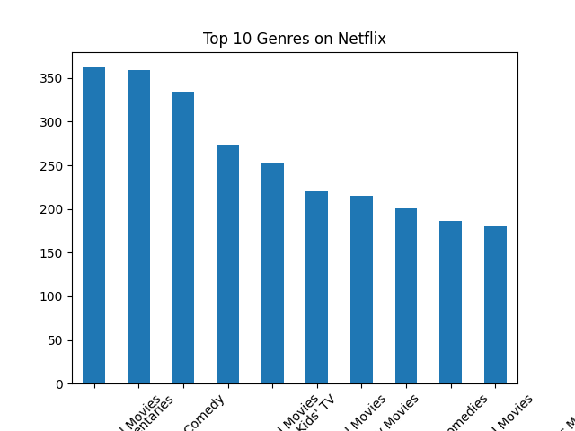
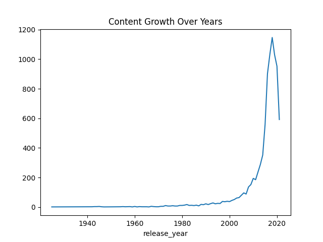

# Netflix Data Analysis 📊

## 📌 Overview
This project analyzes Netflix Movies and TV Shows dataset using Python.

## 🧰 Tools Used
- Python (Pandas, NumPy)
- Matplotlib

## 📊 Key Analysis
- Top Genres
- Content Growth Over Years
- Country-wise Distribution
- Movies vs TV Shows
- Ratings Analysis

## 🎯 Insights
- Drama & International Movies are most popular
- Content increased significantly after 2015
- USA & India are top producers
- Movies dominate over TV shows

## 📸 Sample Visualizations

## 🚀 Conclusion
This project demonstrates data cleaning, EDA, and visualization skills using real-world dataset.
