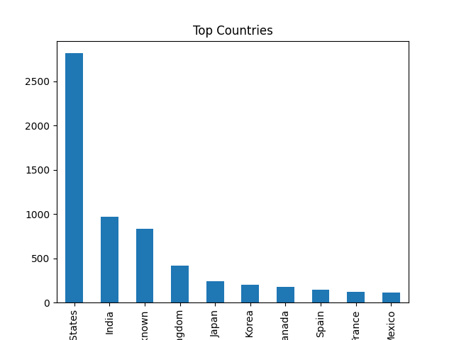
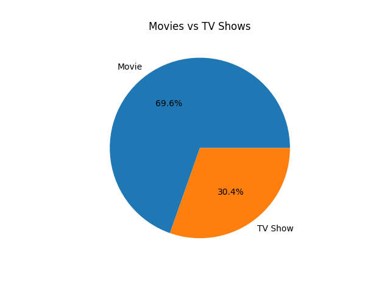
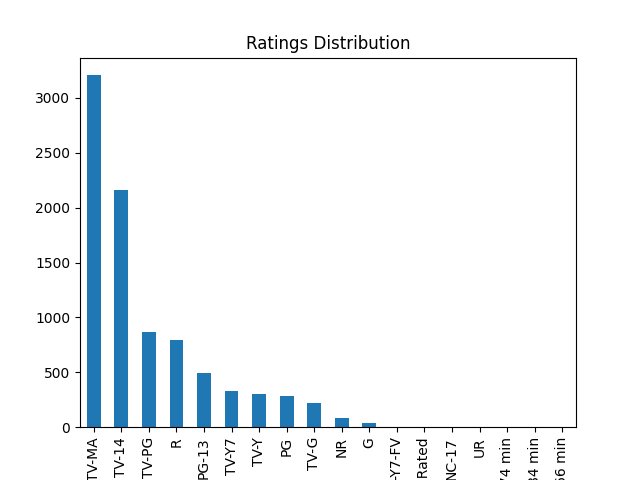

# Netflix Data Analysis 📊

## 📌 Overview

This project explores and analyzes the Netflix Movies and TV Shows dataset using Python. The goal is to uncover patterns, trends, and insights related to content distribution, genres, countries, and growth over time.

---

## 🧰 Tools & Technologies

* Python
* Pandas
* NumPy
* Matplotlib

---

## 📊 Key Analysis Performed

* 📌 Top Genres on Netflix
* 📈 Content Growth Over Years
* 🌍 Country-wise Content Distribution
* 🎬 Movies vs TV Shows Comparison
* ⭐ Ratings Distribution Analysis

---

## 📊 Sample Visualizations






---

## 🎯 Key Insights

* Drama and International Movies are the most popular genres
* Netflix content has grown significantly after 2015
* USA and India are the top content-producing countries
* Movies dominate the platform compared to TV Shows

---

## 🚀 How to Run the Project

1. Clone the repository

   ```bash
   git clone https://github.com/Alamgeer365/Netflix-Data-Analysis.git
   ```

2. Install required libraries

   ```bash
   pip install -r requirements.txt
   ```

3. Open Jupyter Notebook

   ```bash
   jupyter notebook
   ```

4. Run the notebook file inside the `notebooks` folder

---

## 📂 Project Structure

```
Netflix-Data-Analysis/
│── data/
│   └── netflix_titles.csv
│── images/
│   ├── genres.png
│   ├── growth.png
│   ├── country.png
│   ├── rating.png
│   ├── type.png
│── notebooks/
│   └── netflix_analysis.ipynb
│── README.md
│── requirements.txt
```

---

## 📌 Conclusion

This project demonstrates practical skills in data cleaning, exploratory data analysis (EDA), and data visualization using a real-world dataset. It highlights the ability to derive meaningful insights from raw data.

---


